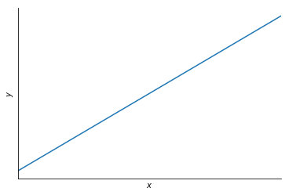
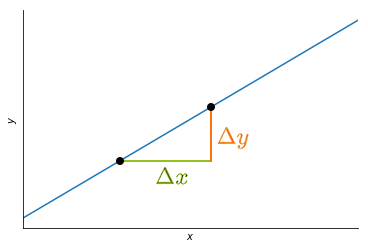

# 2.2 Slope of a Line

The idea of a slope of a line is to describe the rate of change of a vertical variable \($$y$$\), with respect to an horizontal variable \($$x$$\).

To find the slope of this line, we can pick two points on it and calculate the change in $$x$$ between them:

The Greek letter Delta $$\Delta$$ is a shorthand for "change" so $$\Delta x$$ mean "change in x".

So the slope is equal to the change in $$y$$ over the change in $$x$$:

$$slope=\frac{\Delta y}{\Delta y}=\frac{rise}{run}$$

It is sometimes describes as **rise over run**. It is associated with the slope because it has a constant rate of change. If we take any two points anywhere on this line and do this calculation, we would get the same slope. That's what makes it a line.

Later in the Derivative chapter on Differential Calculus, we will see that we can apply the idea of the rate of change not just to a line \(which is called it's slope\) but to a curve. It would be called the **instantaneous rate of change of the curve**. A curve is something whose rate of change is possibly constantly changing.

