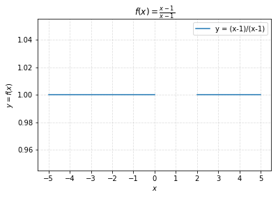
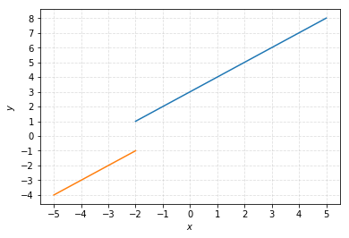
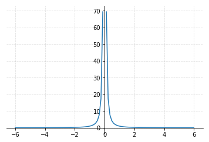
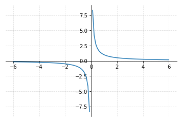
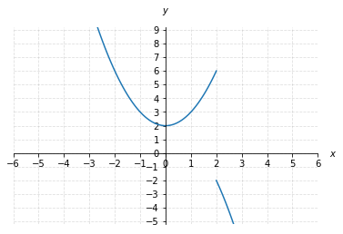

# 3.1 Limits and Continuity

## Limits Intro

The idea of a limit is very important. One can say that all calculus is based upon it. Good news it's also a very simple idea!

To explain it, let's define the following function:  
$$f(x)=\frac{x-1}{x-1}$$\(2.1.1\)

Of course, divide something by itself is just equal to 1 so you may want to simplify it by saying $$f(x)=1$$but what if $$x=1$$? It would be a division by zero, which is undefined: $$f(1)=\frac{1-1}{1-1}=\frac{1}{0}$$.   
What if we graph this function?

So for any $$x$$other than 1, $$f(x)$$is going to be equal to 1. But for $$x=1$$, there is a gap, we don't know what this function equals at 1. This is literally undefined. But as $$x$$ get closer and closer to 1, what is the function approaching? 1 of course. 

We can say that the limit of $$f$$ as $$x$$ approaches 1 is 1. Which is denoted:

$$\lim\limits_{x \to 1}f(x)=1$$

The idea is that we could be infinitely close to 1, as long as we are not at 1, $$f(x)=1$$. If we get 0.9999 or 1.0001, we would get a number really close to 1. So the limit allow us to say that for $$x=1$$, $$f(x)$$ is essentially equal to 1. 

**We say that the limit of** $$f$$ **at** $$x$$ **equals 1 is 1**.

In conclusion, the limits don't depend on the actual value of the function at the limit. They describe how the function behaves when it gets close to the limit. 

Note that the limit must be the same from both sides. For example:

With the function $$h$$ giving this graph, the $$y$$ value as we approach -2 depends on on whether we approach from the left or from the right.  
When we approach $$x$$= -2, from the left, the function approaches -1. When we approach $$x$$= -2 from the right, the function approaches 1.

**When a limit doesn't approach the same value from both sides, we say that the limit doesn't exist**.

## Unbounded Limits

Here is the graph of $$y=\frac{1}{x^{2}}$$:

We want to know the limit of $$\frac{1}{x^{2}}$$ as $$x$$ approaches 0, which is denoted as:

$$\lim\limits_{x \to 1}\frac{1}{x^{2}}=?$$

As we can see on the graph, the closer we get to zero from either the left or the right, $$y$$ get larger and larger without approaching a finite value. **We say it's unbounded**. We can also say that the limit does not exist.

Note that to be unbounded, both sides needs to go in the same direction. Let's take the graph of $$y=\frac{1}{x}$$:

As we approach from the left we get to more and more negative values while as we approach from the right, we more and more positive values.  
In this situation, we are not getting unbounded in the same direction so the limit of $$\frac{1}{x}$$ as $$x$$ approaches 0: $$\lim\limits_{x \to 0}\frac{1}{x}$$ **doesn't exist**.

## One Sided Limits

Let's look at the graph of a new discontinuous function:

Here, the value of our function approaching $$x$$= 2 from values less than $$x$$= 2, for example $$x$$= 1.9999 seems to be 6. We denote that 

$$\lim\limits_{x \to 2^{-}}f(x)=6$$

Notice that we put the - as a superscript after the 2 to denote the direction that we are approaching.

Now, if we want to know what is the limit of $$f(x)$$as $$x$$ approches 2 from values greater than 2, we would write the same thing but with a + as a superscript after the 2:

$$\lim\limits_{x \to 2^{+}}f(x)=-2$$

The only way that a limit at 2 would exist is if both of this one-sided limits are the same thing, but they are clearly not:

$$\lim\limits_{x \to 2^{-}}f(x)\neq\lim\limits_{x \to 2^{+}}f(x)$$

So the limit $$\lim\limits_{x \to 2}f(x)$$ does not exist. 

## Approximating Limits With Tables 

Let's take the function $$y=f(x)=\frac{x^{4}-16x^{2}}{6x-24}$$. If $$x$$= 4, this expression would gives $$\frac{4^{3}-16\cdot4^{2}}{6\cdot4-24}=\frac{0}{0}$$, which is undefined. We can get a sense of what the limit might be without a graph, by setting up two tables. In the first one, we will put x values and the corresponding y values that get closer and closer to 4 from the left \(less than 4\) and on the second one we will do the same but for values from the right \(more than 4\).

Limit from the left:

| $$x$$ | $$f(x)$$ |
| :---: | :---: |
| 3.9 | $$\approx$$20.026 |
| 3.99 | $$\approx$$21.200 |
| 3.999 | $$\approx$$-21.320 |
| 3.9999 | $$\approx$$21.332 |

Limit from the right:

| $$x$$ | $$f(x)$$ |
| :---: | :---: |
| 4.1 | $$\approx$$22.693 |
| 4.01 | $$\approx$$21.466 |
| 4.001 | $$\approx$$21.346 |
| 4.0001 | $$\approx$$21.334 |

Every time we get closer to 4, we get a better estimation of the limit.  
It looks like the limit is approaching 21.3:

$$\lim\limits_{x \to 4}\frac{x^{4}-16x^{2}}{6x-24}=21.3$$

