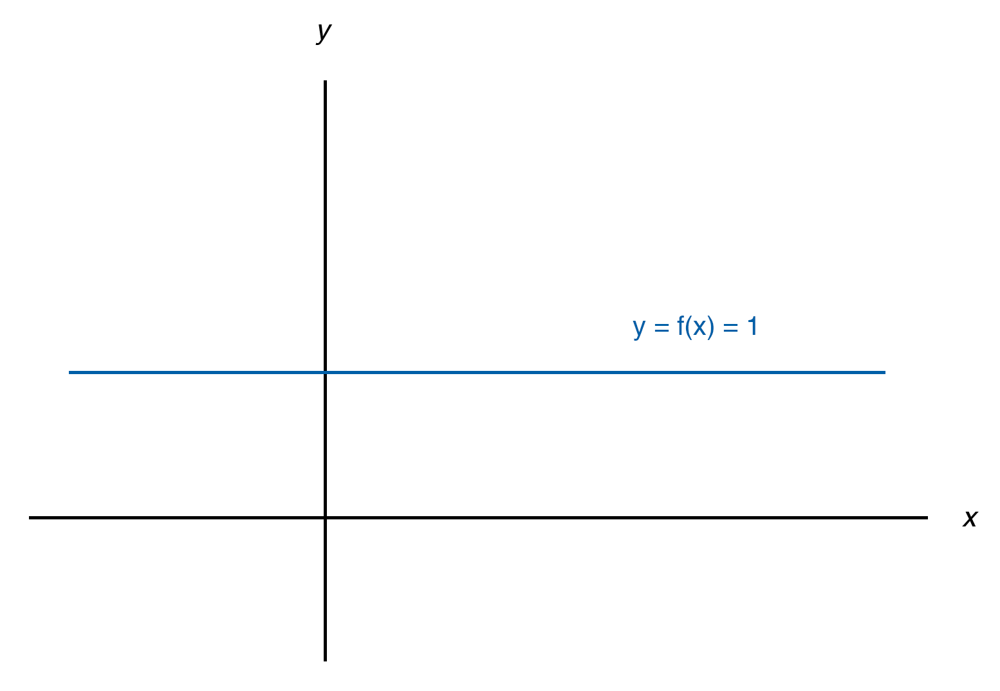

# 3.2 Derivatives

## Basic derivatives Intro

Differential calculus is all about instantaneous rate of change. About how fast is something going right now. To illustrate this, we will use the graph of the speed of a train over time:

It's speed is not constant. It starts from 0 and increase, which mean there is an acceleration. Toward the end of the time period the train's speed is rapidly decreasing, meaning it's decelerating.  
At any given time, the slope is different. At the beginning it has a fast rate of change.

Let's try to approximate the slope of the red point. We can do that by calculating the change in $$y$$over the change in $$x$$. So we take some change of $$x$$ and figure out what the change of $$y$$ will be.

Because the slope of the curve is constantly changing, this will just be an approximation. Notice that as our change of $$x$$ gets smaller and smaller, we will have a better approximation. The resulting change of $$y$$ is also going to be smaller and smaller.  
It turns that what we are really looking for is the limit as $$\Delta x$$ approaches 0 of our change in $$y$$ over our change in $$x$$:

$$\lim\limits_{\Delta x \to 0}\frac{\Delta y}{\Delta x}$$= instantaneous rate of change or instantaneous slope at that point in the curve or the slope of the tangent line at that point in the curve. In calculus terminology **we would view that as the derivative**, which is denoted:$$\frac{dy}{dx}$$, so:

$$\lim\limits_{\Delta x \to 0}\frac{\Delta y}{\Delta x}=\frac{dy}{dx}$$

We say that $$dy$$ is a differential and $$dx$$ is a differential too.  
Conceptually, $$dy$$ is an infinitely small change in $$y$$ over an infinitely small change in $$x$$, which allow us to get the instantaneous slope or in the train example, the instantaneous acceleration.

## The Concept of Derivatives

Remember the idea of the slope of a line? A slope is the rate of change of a line. This idea can be extended to a curve, in which case we would talk about the instantaneous slope, or the instantaneous rate of change.

As we said before, a curve is something whose rate of change is possibly constantly changing.

The average rate of change between the two green points would be the slope of the sequent line that connects them. But it would be different than the average rate of change between the two orange points.

A more interesting question is to know what is the instantaneous rate of change at a point. How fast is changing $$y$$ with respect to $$x$$ when $$x$$ is equal to a given value. One way to do this is by drawing a tangent line to this point and calculate it's slope.  
**This idea of the instantaneous rate of change is the central idea of differential calculus and is known as a derivative**.  
To emphasise it more, let me repeat that the slope of the tangent line of a point on a curve can be viewed as the instantaneous rate of change, and is called a **derivative**.

On the graph above, we have a blue curve and the tangent of the red point on this curve. We denote it's derivative \(the slope of the tangent line\) using the Leibniz's notation: $$\frac{dy}{dx}$$, which is sometimes referred to as   
differential notation. It express the idea of what happens as the change in $$x$$ approaches 0.

There is other notations. If the blue curved is described as $$y=f(x)$$, the slope of the tangent line at the red point could be denoted as $$f'(x_1)$$ . It's called the Lagrange notation. $$f'$$is representing the derivative. It's telling us the slope of the tangent line for a given point.

In physics, you can also see it with the notation $$\dot{y}$$or another common math notation: $$\hat{y}$$.

Next step is to build the tools to calculate this derivates, which consist of taking the limit of our change in $$y$$ over change in $$x$$as our change in $$x$$approaches zero. But we don't want to just be able to figure out for a point, we want to figure out general equations that describe the derivative for any given point.

## Notation review

Lagrange's notation: $$f'$$

Leibniz's notation: $$\frac{dy}{dx}$$

Newton's notation: $$\dot{y}$$

## Formal definition of the derivative as a limit 

So we want to find the slope the tangent line of a point on a curve: the derivative of this point. First, we need a line, and to have a line, we need two points. This is where it can be confusing because we are talking about the derivative at a single point $$x_i$$, and $$y=f(x_i)$$. In fact, we are taking a second point $$x+h$$where $$h$$is an arbitrary number. It could be 1, 5, 1000, -200 or it could be an arbitrarily small number. And with this second point, we have a sequent line on our curve from which we can calculate the slope.  
And this is where the limits comes in handy. If we take the limit as h approaches 0, we will get closer and closer to finding the slope of the line right at the point in question.  
So we would take the limit as h approaches 0 of our sequent line slope:

$$\lim\limits_{h \to 0}\frac{f(x_i+h)-f(x_i)}{h}$$ = Derivative of $$f(x)$$= $$f'(x)$$

Where $$f(x_i+h)-f(x_i)$$is the change in $$y$$ and $$h$$, the change in $$x$$. We usually denote it $$\lim\limits_{\Delta x \to 0}\frac{\Delta y}{\Delta x}$$

So $$f'(x)$$is another function because the slope change at every $$x$$ value \(or at least, it can change\).

## Differentiability and continuity

The notion of differentiability at a point is a way of saying "does the function have a defined derivative at a point?". To illustrate this, we will use the derivative $$f'(b)=\lim\limits_{x \to b}\frac{f(x)-f(b)}{x-b}$$

Now here is some claim we can make:

* If $$x$$is differentiable at $$x=b$$, then $$x$$is continuous at $$x=b$$. Note that it's not necessarily the case the other way around.
* If $$f$$ is not continuous at $$x=b$$, then $$f$$in not differentiable at $$x=b$$.

We will delve into the details of the proof being this claims but try to build the intuition why they are true by taking some examples. First, let's take the example of a non-continuous function and see if we are able to find the limit.

Here we first want to find the left side of the limit for the point $$(b, f(b))$$. We can start by finding the slope of the tangent line between the points  $$(x_1, f(x_1))$$and $$(b, f(b)),$$ and then let $$x_1$$ be closer and closer to $$(b, f(b))$$. In all the cases, the slope would be 0. So the derivative or this limit, as we approach from the left seems to be approaching 0.

Now, if we are approaching from the right, from the point $$(x_2, f(x_2))$$, as we get closer and closer to $$x$$ being equal to $$b$$, we see that the slope is approaching negative infinity. More importantly, it's approaching a very different value from the right as it is from the left. 

In this case, this limit $$\lim\limits_{x \to b}\frac{f(x)-f(b)}{x-b}$$ won't exist so we conclude that this is not differentiable. If something isn't continuous, it will not be differentiable.   
In a situation where $$f$$isn't define at $$b$$, the part $$-f(b)$$ of the expression $$\frac{f(x)-f(b)}{x-b}$$ wouldn't make sense so it wouldn't be differentiable.

**It doesn't mean that a continuous function is always differentiable**.

This illustrate an absolute value function where $$y$$is equal to the absolute value of $$x-b$$. It turns out that this function isn't differentiable at $$b$$ because the value of $$\lim\limits_{x \to c}\frac{f(x)-f(c)}{x-c}$$ would approach two different values as $$x$$ approaches $$c$$ from the left or the right. Then this limit will not exist. This function is not différentiable at $$x=b$$.

## Power Rule 

It's time to cover the power rule. It simplify our lives when it comes to takes derivatives, especially derivatives of polynomials. Let's take the definition of a derivative $$\lim\limits_{\Delta x \to 0}\frac{f(x + \Delta x)-f(x)}{\Delta x}$$ which comes out of trying to find the slope of a tangent line at any given point. Using the power rule, we won't have to take these limits.

The power rule tells us that if I have some function $$f(x)=x^n$$ where $$n \neq 0$$ \(so $$n$$ can be anything, it can be negative or positive\), it's derivative $$f'(x)=nx^{n-1}$$.

**Examples**: 

Let's take $$f(x)=x^2$$, based on the power rule $$f'(x)=2x$$.  
Let's take $$g(x)=x^3$$, based on the power rule $$f'(x)=3x^2$$.  
Let's take $$h(x)=x^{-100}$$, based on the power rule $$h'(x)=-100x^{-101}$$.  
Let's take $$z(x)=x^{2.571}$$, based on the power rule $$z'(x)=2.571x^{1.571}$$.

### Rewriting expressions

Let's say we take the derivative with respect to $$x$$ of $$\frac{1}{x}$$,  that we can denote $$\frac{d}{dx}(\frac{1}{x})$$. How does the power rule apply here? The key is to appreciate that $$\frac{1}{x}$$ is the same thing as $$x^{-1}$$. So:   
$$\frac{d}{dx}(\frac{1}{x})=\frac{d}{dx}(x^{-1})=-1x^{-1-1}= -x^{-2}$$.

Let's take another example where $$f(x)=\sqrt[3]{x}$$. Once again we have to rewrite the expression since $$\sqrt[3]{x}=x^{\frac{1}{3}}$$so $$f'(x)=\frac{1}{3}x^{\frac{-2}{3}}$$.

## Basic derivatives rules

_Constant, sum, difference, and constant multiple._

Now that we know the power rule it's time to get exposed to a few more rules or concepts or properties of derivates that essentially allow us to take the derivative of any polynomial.

### Constant property

First, let's go back to the special case of $$n \neq 0$$. What happens when $$n$$ equals 0? We can illustrate this by taking the derivative  $$\frac{d}{dx}[x^0]$$, where $$x \neq 0$$\(weird things happen at that point\). $$x^0$$ is always going to be 1. To make it clearer we can graph the derivative with respect to $$x$$ of 1: $$\frac{d}{dx}[1]$$

So $$f(x)=1$$ is just an horizontal line. Remember one way to conceptualize the derivative is that it's just the slope of the tangent line at any point. Here, the slope of the tangent line at any point is the same since we have a completely horizontal line. It has a slope of 0.  
**It's going to be true for any constant**: $$\frac{d}{dx}[A]=0$$ \(where A is a constant\). With this knowledge, we can explore a few more properties.

Let's say we want to take the derivative with respect to $$x$$ of some constant $$A$$ time some function: $$\frac{d}{dx}[Af(x)]$$. **We can actually take this constant out of the derivative**, which give us $$\frac{d}{dx}[Af(x)]=A\frac{d}{dx}[f(x)]$$. We can also denote this result $$Af'(x)$$.   
This may look like really fancy notation but it will make more sense with the following example:

So what about taking the derivative with respect to $$x$$ of $$2x^5$$:

$$\frac{d}{dx}[2x^5]=2 \frac{d}{dx}[x^5]=2 \cdot 5x^4 = 10x^4$$

As you can see, we can now combine the power rule and this property to take the derivative of anything that takes the form $$Ax^n$$.

### Sum property

Now we talk about another very useful derivative property that doesn't just apply to the power rule but to any derivative. Note that it's especially useful for the power rule because is allow us to construct polynomials and take the derivative of them.

If we were to take the derivative of the sum of two functions $$\frac{d}{dx}[f(x)+g(x)]$$, it's the same thing as $$\frac{d}{dx}[f(x)] + \frac{d}{dx}[g(x)]$$. Which can also be denoted by $$f'(x)=g'(x)$$.  
Once again, it can look like kind of a fancy notation so we will see an example to make it clearer.

If we have $$\frac{d}{dx}[x^3 + x^{-1}]$$, this tells us that **the derivative of the sum is just the sum of the derivatives**. And we can take the derivative of this terms using the power rule. So $$\frac{d}{dx}[x^3 + x^{-1}] = 3x^2 + (-4)x^{-5}$$.

Now, we have all the tools we need in our toolkit to essentially take the derivative of any polynomial.

**Examples**:   
Let's take the derivative of different terms.

* $$f(x) = 2x^3$$, $$f'(x)=2 \cdot 3x^2=6x^2$$
* $$f(x)=-7x2$$, $$f'(x)=-7 \cdot 2x=-14x$$
* $$f(x)=3x$$, $$f'(x)=3$$ \(because $$3x=3x^1$$ so it's derivative is $$3 \cdot 1x^{1-1} = 3 \cdot 1x^0 = 3$$\)
* $$f(x)=-100$$, $$f'(x)=0$$

### Find the error

